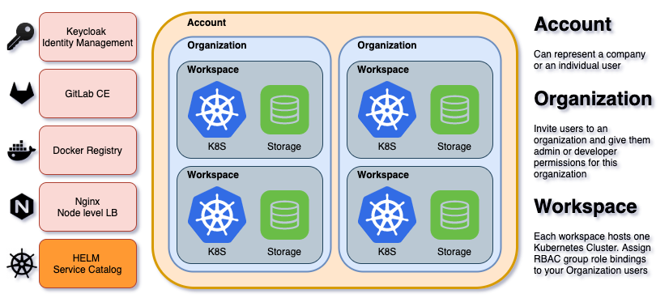

# Getting Started

## Prerequisite

1) Installed the "control plane" and at least one "host-node" according to the [installation](INSTALL.md#installation) instructions.
2) Install the MultiPaaS CLI on your local machine, please see section [Install the CLI](INSTALL.md#install-the-cli).  

## Tenant - Logical view

MultiPaaS is a Multi tenant / multi Kubernetes Cluster solution. Depending on the requirements, this can be used in various ways:

* In a large organization, that is devided in sub-organizations who are in turn devided into business units, you should assign an `account` to each organization unit in your company
* If your organization is smaller, then you could simply have one single shared `account` to use for everyone, and split up environements by `organizations`, who can then manage multiple clusters (or multiple `workspaces`) within that `organization`
* Last but not least, if you wish to use MultiPaaS only for one organization or team, simply create one `account`, one `organization`, and manage your `workspaces` from there.

As you see, this gives you a certain flexibility as of how you wish to divide things.

Let's look at the other components available in MultiPaaS. Some components are shared amongst tenants:

* Keycloak - SSO Authentication
* Private GitLab CE instance
* Private Docker Registry
* NGinx Proxy load balancer server
* HELM Private Service Catalog

### Keycloak

Keycloak is a Identity and Access Management solution, providing a centralized way to implement SSO and connect it to most Identity management systems out there.  
Keycloak is primarily used to manage MultiPaaS API users, GitLab, Docker Registry and Kubernetes RBAC.

### GitLab CE

Manages your private source code and provides DevOps pipelines to build, store and deploy your container based applications.

### Docker Registry

Store your build containers privately, and deploy your applications to your cluster from the CLI or from a GitLab pipeline.

### NGinx Proxy

Serve your applications and services outside your Kubernetes cluster. Configure your domain names, subdomains and SSL certificates.

### HELM Service Catalog

The way to deploy PaaS level services such as databases or streaming services (and more) to your kubernetes cluster

## Register an account, set up & scale my first cluster

## Deploying Services & Applications

## Canary deployments, blue / green deployment, domain names & SSL

## Invite users to my organization and manage RBAC roles

TODO