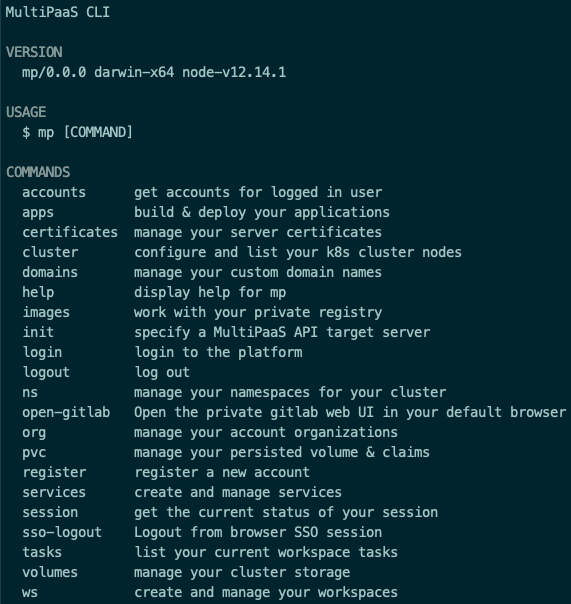

# Installation

An example of the overall topology once deployed can look like the following:


> The above diagram is an example setup. For testing purposes, you can install the "Control Plane" and one "Host Node" on a single machine. 
> For a production environement, you should deploy the "Controller Plane" on a dedicated machine, and a minimum of 2 "Host Nodes", each on it's own machine.
>
> I tested MultiPaaS on Ubuntu 18.04, as well as on CentOS / RedHat 8.

As seen in the diagram above, `MultiPaaS` is composed of a `control-plane` environement, and at least one `host-node` controllers.


> PLEASE NOTE: As of now, MultiPaaS can be installed on `CentOS / RedHat 8` or `Ubuntu 18.04` only. 

Here is a video on the installation procedure of MultiPaaS for those who prefer watching rather than reading:

[](https://www.youtube.com/watch?v=b_xpeve24rU)

## Some notes about DHCP

`MultiPaaS` is a multi-tenant Kubernetes cluster solution (1 K8S cluster for each tenant), this means that each tenant cluster node will run on a dedicated VM on the network. Worker nodes are linked to their master nodes, therefore VM IPs need to not change over time once they are assigned. The developement of MultiPaaS is done on a typical home router, where IPs are assigned randomely when a machine joins the network. Problems occure when a VM is down, and the router's DHCP server assigns that VMs IP to a new machine that joins the network. Once the VM starts up again, that IP is gone and the VM get's a new IP, thereby breaking the cluster.  

To prevent this from happening, MultiPaaS takes control over IP assignement for cluster VMs. Two solutions are available here:

1. Dedicate a Router specifically to MultiPaaS, hense no other machines than `K8S cluste VMs`, the `control-plane` and `host-nodes` will live on that network.
2. Reserve a certain IP address range for MultiPaaS VM IPs on your router network. Simply instructing your router to assign IPs for new random machines that are joining the network to address space XXX.XXX.XXX.2 - XXX.XXX.XXX.50 (this is an example of course, up to you to decide how many IPs you want to reserver), and leave address space XXX.XXX.XXX.51 - XXX.XXX.XXX.254 for MultiPaaS VMs.

> This configuration is available on the `MultiPaaS Task Controller` component, by setting specific environement variables. More on this later, I just wanted to raise awareness on that specific subject before moving on to the installation part.


## Prepare the environement before the installation

Before installing the `control-plane` and the `host-node` packages on the target machines, you need to prepare, download the required dependencies upfront and build the base images. To do this, use the helper script that will perform those tasks for you. This script will provision the required VM environements in order to download the required packages & images based on your target OS, as well as building the core components of the solution from inside that VM.  
To prepare the various components, MultiPaaS uses Vagrant. This will keep your build machine clean and ensure that the build outcomes are compatible with the target runtimes.  
The only components that will be installed locally on your machine are VirtualBox & Vagrant (if not already present). Everything else will happen inside VMs.

> The reason for this preparation step is that we need to download & build everything upfront so that we can install the various components in a offline (as well as online) environement later on.    

The preparation script will perform the following tasks:

- Download target OS psecific packages upfront
- Download all Docker images upfront
- Build Vagrant boxes required for the `control-plane` and `host-node` environements
- Install Vagrant base boxes on `control-plane` and `host-node` environements
- Resolve dependencies for the `host-node` components upfront

> PLEASE NOTE: Even if you intend on installing `MultiPaaS` in an online environement, this step is required.

MultiPaaS uses Vagrant to build everything. This will keep your build machine clean and ensure that the build outcomes are compatible with the target runtimes.  
The only components that will be installed locally on your machine are VirtualBox & Vagrant (if not already present). Everything else will happen inside VMs.  

Lets start by cloning the repository on a `CentOS / RedHat 8` or `Ubuntu 18.04` machine:

```
git clone https://github.com/mdundek/multipaas.git
```

### A script to prepare for deployment

The script is located at `install/build/prepare.sh`. It takes the following arguments:

| Argument 	| Description 	|
|------------------------------	|-----------------------------------------------------------------------------------------------------------------------------------------------------------------------------------------------------------------------------------------------------------	|
| -skbb \| --skip-base-box 	|  Do not build the basebox VM. Use this flag if you alreday installed<br />the basebox on your machine, and wish to perform other tasks. 	|
| -skkb \| --skip-k8s-boxes 	|  Do not build the boxes required for the `host-node` runtime,<br />boxes necessary to provision clusters for the tenants. 	|
| -sktb \| --skip-target-build 	|  Do not download and build the libraries and images necessary<br />to deploy    the `control-plane` and `host-node` on the target systems.<br />Use this flag if you simply want to install a already build box on the<br />`control-plane`   or `host-node` machines. 	|
| -ibb \| --install-base-box 	| Install the basebox VM on the current machine 	|
| -ikb \| --install-k8s-boxes 	| Install the Kubernetes master and worker boxes on the current machine 	|


If you run this script for the first time, simply execute it without any arguments:

```
./install/build/prepare.sh
``` 

The script will look for Virtualbox & Vagrant on your system. If not pressent, it will propose to instrall them for you.  

> NOTE: On `CentOS 8` & `RedHat 8`, if the script installes Virtualbox, then you will have to reboot your machine and re-run this script again. Simply follow the instructions provided during the process.  

Go have a coffe, this script will take a while to finish (on my Macbook Pro, it takes arount 30 - 40 minutes).

You are now ready to install the MultiPaaS core components. For this, jump to the section [Install the Host Nodes (RedHat / CentOS & Ubuntu)](INSTALL.md#install-the-control-plane-redhat--centos--ubuntu)


  
## Install the Control-Plane environement

__Before you move on, make sure went through the preparation steps mentioned in the previous chapter.__

The `control-plane` is installed inside a dedicated VM, that hosts: 

- `Docker registry` for your private Docker images
- `GitLab CE` for your private GIT environements
- `Keycloak` SSO authentication gateway
- `PostgreSQL` database
- `NGinx` proxy server
- `multipaas-api` server to talk to the `mp` CLI
- `multipaas-ctrl` server for job orchestration and configuration tasks

Since all those elements are running inside a VM, it does not matter on what environement you will run the `control-plane`. That said, the installation script for the `control-plane` are `bash` scripts, that are written to run on `Ubuntu 18.04` and `CentOS / RedHat 8`.

> NOTE: If the target machine for the `control-plane` is a different machine that the one used to run the preparation script, then copy the repo folder over to the target machine (using a USB key for instance if the target has no internet connection).

Before installing the `control-plane` components, you will have to import the Vagrant basebox to the target machine. This basebox has been created during the preparation phase of the deployment. To install the box, run the following command:

```
./install/build/prepare.sh \
    --skip-base-box \
    --skip-k8s-boxes \
    --skip-target-build \
    --install-base-box
```

Once done, start the installation of the `control-plane`. For this, execute the following script:

```
./install/control-plane/install.sh
```

The script will ask for some base configuration values. Provide a static IP for the controller plane VM on the target network that MultiPaaS will be running on, admin credentials and VM sizing parameters.  
At some point, the script will pause and ask you to do some manual configuration steps before continuing. Those step details will be provided to you in the terminal directly.

> NOTE: It is currently not possible to deploy the various MultiPaaS components on disparate networks (different LANs or WANs). The controll-plane and the host-nodes all have to be deployed on the same network (xxx.xxx.xxx.2-249). This gives you enougth addresses for over ~200 K8S Cluster VMs in total for all your tenants, given that your network can handle the traffic of course.  
> To overcome this limitation, some extra developement work is necessary. At some point, this should become a priority in the developement of MultiPaaS, idealy involving some network specialists that could provide me with some guidance about what it would take to set up a more complex network topology. 


## Install the Host-Node services

__Before you move on, make sure went through the preparation steps mentioned in the previous chapter.__

The `host-node` component is responsible for Virtualbox based K8S Cluster management tasks as well as Volume provisionning tasks such as local volumes as well as Gluster volumes.  
You can chose to deploy a `host-node` component to handle only Gluster Volume management tasks, Kubernetes Cluster management tasks or both. This can be usefull if you wish to dedicate certain host machines to distributed Gluster storage management only, and let other host machines deal with Virtualbox and K8S Cluster specific tasks.  

The `host-node` controllers will also take care of scaling up or down your Kubernetes clusters, and deal with the setup of volumes, configure access to the docker registry, provision services on your cluster and more.  

The `host-node`'s are not running in VMs, they need to run directly on the target host. The reason for this is that the `host-node` service is managing the tenant's K8S Cluster Node VMs using `VirtualBox` APIs. VMs inside VMs are possible, but I have not tested this and suspect that this might have some performance limitations.  
The `host-node` only requires `NodeJS >= 12`, `PM2` to keep the `host-node` service alive and manage it's logs, and `VirtualBox`of course.  

> NOTE: If the target machine for the `host-node` is a different machine that the one used to run the preparation script, then copy the repo folder over to the target machine (using a USB key for instance if the target has no internet connection).

Before installing the `host-node` components, you will have to import the Vagrant Kubernetes base boxes to the target machine. Those baseboxes have been created during the preparation phase of the deployment. To install the boxes, run the following command:

```
./install/build/prepare.sh \
    --skip-base-box \
    --skip-k8s-boxes \
    --skip-target-build \
    --install-base-box \
    --install-k8s-boxes
```

Once done, start the installation of the `host-node`. For this, execute the following script:

```
./install/host-node/install.sh
```

Again, the script will ask for some base configuration values. Provide the static IP address chosen during the `control-plane`installation, enter the database password required to connect to the admin database, and specify if you wish to install the `host-node` controller to controll kubernetes clusters, gluster servers or both.  
Some steps require sudo, at which point the script will ask for your credentials. 

Once you have installed the `host-node` controller on all target machines, you are done and ready to start using MultiPaaS cloud.


## Install the CLI

Interacting with the `control-plane` API is done through the MultiPaaS CLI (aka. `mp`).  

To install the CLI, 2 options are available.

1. By linking the repo CLI source folder to the `mp` command (offline)
2. Installing the `mp` command from the official NPM repo (online)

__Option 1: By linking the repo CLI source folder to the `mp` command__

Navigate to the following folder:

```
cd ./src/cli
```

and execute the command:

```
sudo npm link
```

That is it! Test the CLI by printing the CLI help section:

```
mp --help
```



__Option 2: Installing the `mp` command from the official NPM repo__

> NOTE: For the time being, the MultiPaaS CLI is not published on NPM.  
> As soon as MultiPaaS comes out of it's Alpha stage, the CLI will be published there and made available for direct installation